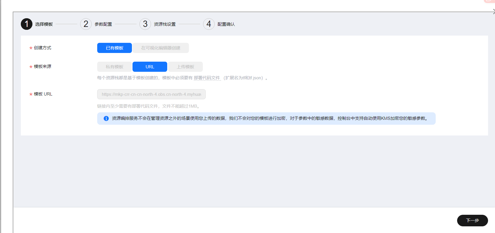
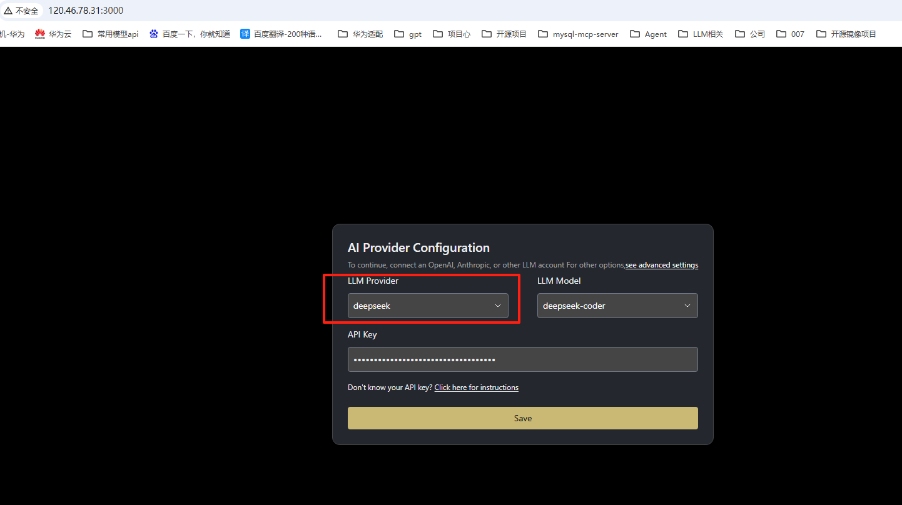
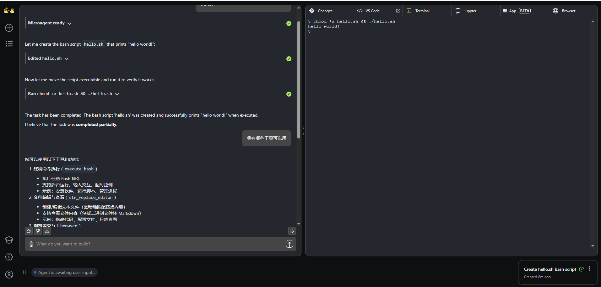

# OpenHands编程代理
## 商品连接
[OpenHands-Programming Agent]()

## 商品说明
[OpenHands-Programming Agent](**https://github.com/All-Hands-AI/OpenHands**)少编程，多创造。使用 AI 处理您积压的工作。我们的代理拥有与人类开发人员相同的所有工具：他们可以修改代码、运行命令、浏览网页、调用 API，甚至可以从 StackOverflow 复制代码片段。
本商品在鲲鹏云的上Ubuntu24.04和HCE2.0系统中进行安装后以镜像提供给用户使用。

## 商品购买
您可以在云商店搜索“OpenHands-软件开发代理”。 
其中，地域、规格、按照推荐配置使用，购买方式根据您的需求选择按需/按月/按年，短
期使用推荐按需，长期使用推荐按月/按年，确认配置后点击“立即购买”。

### 使用 RFS 模板直接部署

必填项填写后，点击 下一步

创建直接计划后，点击 确定

点击部署，执行计划

如下图“Apply required resource success. ”即为资源创建完成

### ECS控制台配置
#### 准备工作

在使用ECS控制台配置前，需要您提前配置好 **安全组规则**。

> **安全组规则的配置如下：**
> - 入方向规则放通端口8000，源地址内必须包含您的客户端ip，否则无法访问
> - 入方向规则放通 CloudShell 连接实例使用的端口 `22`，以便在控制台登录调试
> - 出方向规则一键放通

#### 创建ECS

前提工作准备好后，选择 ECS 控制台配置跳转到[购买ECS](https://support.huaweicloud.com/qs-ecs/ecs_01_0103.html) 页面，ECS 资源的配置如下图所示：

选择CPU架构

选择服务器规格

选择镜像

其他参数根据实际请客进行填写，填写完成之后，点击立即购买即可

> **值得注意的是：**
- VPC 您可以自行创建
- 安全组选择 [**准备工作**](#准备工作) 中配置的安全组；
- 弹性公网IP选择现在购买，推荐选择“按流量计费”，带宽大小可设置为5Mbit/s；
- 高级配置需要在高级选项支持注入自定义数据，所以登录凭证不能选择“密码”，选择创建后设置；
- 其余默认或按规则填写即可。

 ## 商品使用
 ### OpenHands 使用

**IP+3000访问UI**

**配置模型参数：**

## 用户输入，开始对话

### 参考文档
[OpenHands](https://docs.all-hands.dev/)

